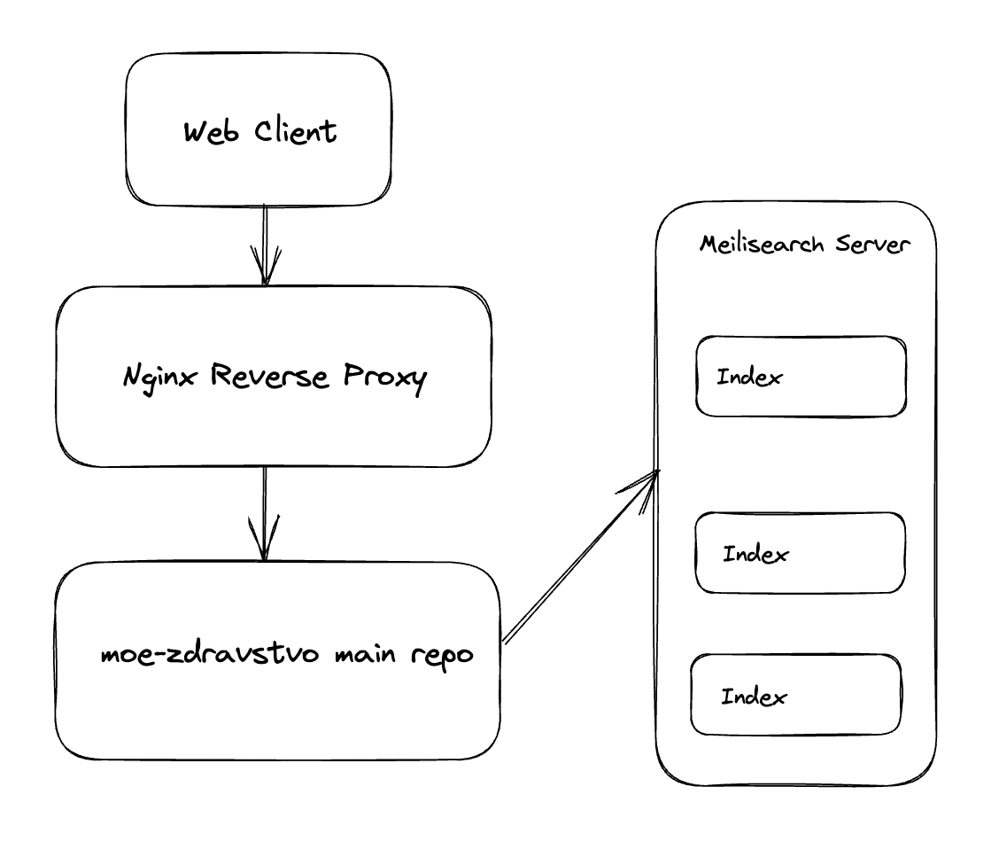

# Мое Здравство
TBD интро за целиот проект.

## Архитектура
Засега архитектурата е доста едноставна, имено:

[Главното repo](https://github.com/moe-zdravstvo/moe-zdravstvo-main) ќе седи пред Meilisearch сервер, кој ексклузивно ќе се користи за чување на сите податоци, а позади Nginx Reverse Proxy кое ќе биде задолжено за статичен кешинг, LB, итн.

Meilisearch серверот ќе е наполнет со повеќе индекси кои ќе содржат различни корпуси скрејпани од јавните информации на Министерството за Здравство (TBD кои сите). 

Индексите ќе се пополнуваат од различни скрејпинг сервиси; За сега само [скрејперот на Регистар на лекови и медицински средства](https://github.com/moe-zdravstvo/medicine-registry-scraper) ќе биде функционален додека не се формализира што се' ќе содржи оваа платформа.

## Повеќе информации
TBD сите документи со функционални барања на платформата.

## Todo
- [ ] TBD
